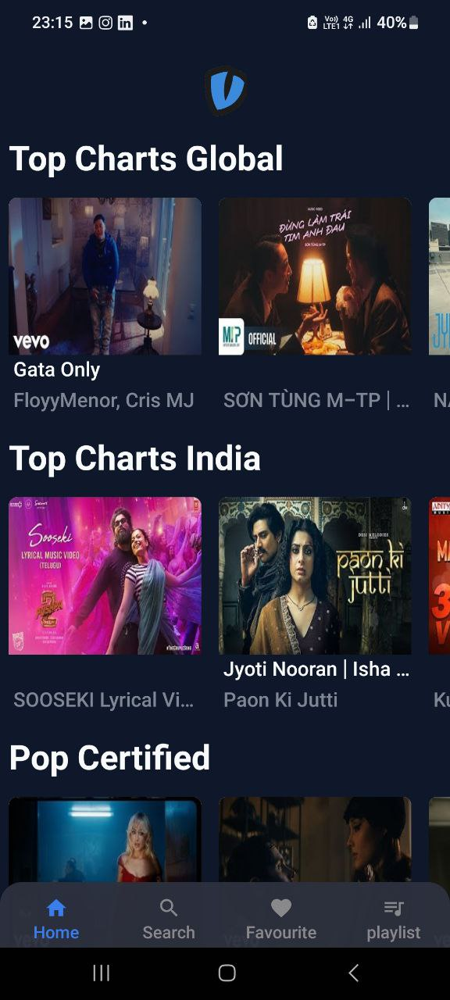

<div align="center""> </div>

<h1 align="center" style="font-size: xxx-large">Vibes</h1>


Welcome to Vibes, the ultimate music streaming app designed for music lovers who enjoy listening to songs on YouTube without the hassle of ads or interruptions. Vibes is built using React Native, providing a smooth and intuitive user experience on both iOS and Android devices. Dive into the world of music and enjoy your favorite tunes seamlessly.


## Table of contents
- [Features](#features-)
- [Installation](#installation-%EF%B8%8F)
- [Usage](#usage-)
- [Screenshots](#screenshots-)
- [License](#license-)

## Features ✨

- **Ad-free Listening**: Enjoy uninterrupted music without any ads.
- **Background Play**: Continue listening to your favorite tracks even when the app is minimized.
- **High-Quality Streaming**: Experience high-quality audio streaming directly from YouTube.
- **User-friendly Interface**: Easy to navigate and use, ensuring a smooth user experience.
- **Playlist Creation**: Create and manage your own playlists.
- **Search Functionality**: Find any song or artist quickly and easily.
- **Favourites**: Mark your favorite songs for quick access.


## Installation 🛠️

Follow these steps to get Vibes up and running on your local machine for development and testing purposes.

#### Prerequisites ✅

- Node.js
- npm or yarn
- expo CLI
- EAS CLI
- Android Studio (for Android)
- Xcode (for iOS)

#### Clone the Repository 📦

```bash
git clone https://github.com/your-username/vibes.git

cd vibes
```
#### Install the dependencies 📥

Using npm:
```bash
  npm install
```
Or using yarn:
```bash
  yarn install
```

### Set Up Expo 🌟
Ensure you have Expo CLI installed:
```bash
  npm install -g expo-cli
```

### Set Up EAS 🚀
Ensure you have EAS CLI installed:
```bash
  npm install -g eas-cli
```
Log in to your Expo account:
```bash
  eas login
```
Configure EAS for your project:
```bash
 eas build:configure
```

### Building the App with EAS 🏗️
For Android:
```bash
 eas build --platform android
```
For IOS:

```bash
 eas build --platform ios
```
### Running the App ▶️
```bash
npx expo start --dev-client
```

## Usage 📖

- **Home Screen**: Browse through trending songs and personalized recommendations.
- **Search**: Use the search bar to find specific songs or artists.
- **Playlists**: Create and manage your playlists from the Playlists tab.
- **Favorites**: Access your favorite songs quickly from the Favorites tab.
- **Player Controls**: Control playback with play, pause, next, and previous buttons. Adjust the volume and see the current track information.


## Screenshots 📸

<div align="center">
    &nbsp;&nbsp;&nbsp;
    &nbsp;&nbsp;&nbsp; 
  &nbsp;&nbsp;&nbsp;
    &nbsp;&nbsp;&nbsp;
</div>

## License 📄

This project is licensed under the [MIT License](https://choosealicense.com/licenses/mit/) - see the [LICENSE](https://github.com/sohamhaldar/Vibes/blob/main/LICENSE) file for more details.
